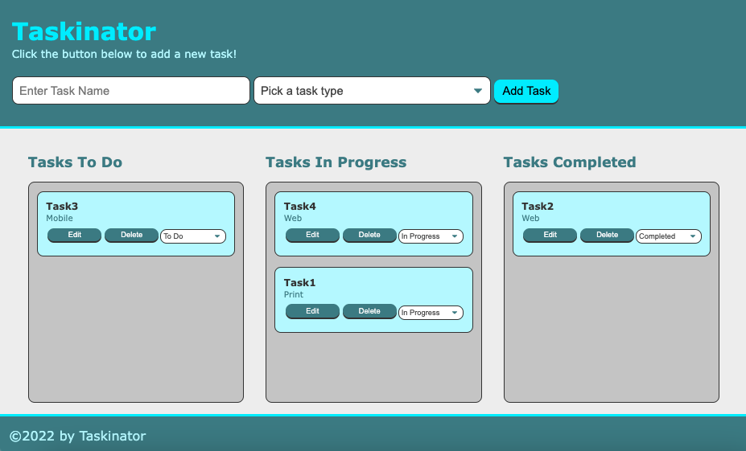

# Taskinator

Taskinator is a Kanban board style To Do list. It uses localStorage so your lists are saved!

## User Interface

## Usage

You start by entering a task name, picking a task type from the dropdown menu, and clicking the 'Add' button. Once you create a task you can edit the task, delete the task, or move it to one of the other categories.

## Links to website and Github
[Taskinator](https://bagl0025.github.io/taskinator/)

<a href="https://github.com/bagl0025/taskinator.git" target="_blank">Github Repository</a>

## Author
Brian Bagley

March 2022
